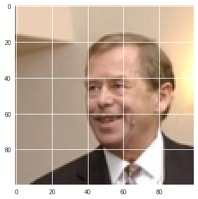
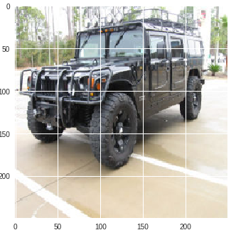
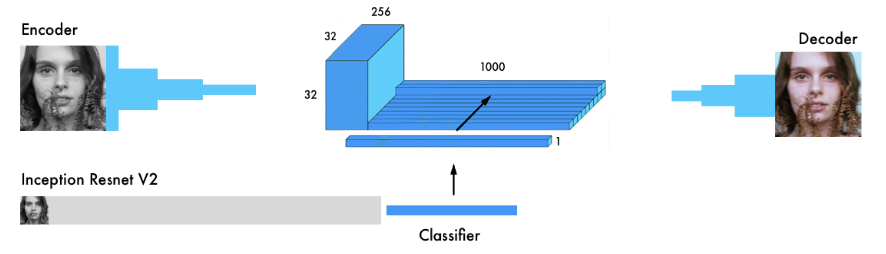
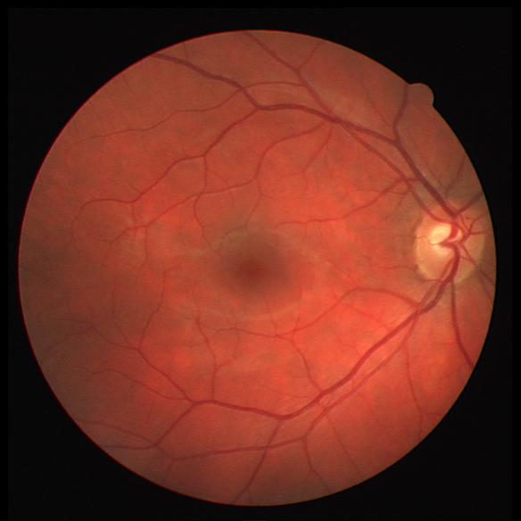
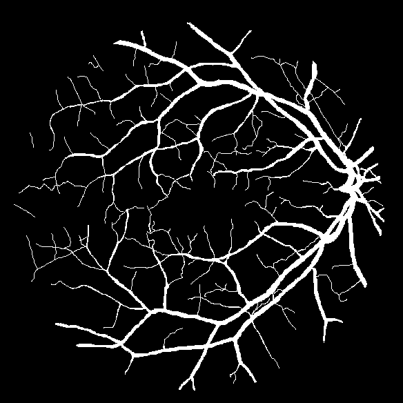

# Computer Vision Lab (up to 10 points)

## Basic implementations

Check basic implementations on CIFAR10 in the Deep Learning Lab project [here](https://github.com/RParedesPalacios/DeepLearningLab/tree/master/Examples/Keras/CIFAR)

**Goals:**

* Implement some basic convolutional networks
* Implement different data augmentation
* Implement VGG model

---

## Advanced topologies 

* Wide Resnet  (1 point) 

* Dense Nets   (1 point)

---

## Gender Recognition (3 point)

Images from "Labeled Faces in the Wild" dataset (LFW) in realistic scenarios, poses and gestures. Faces are automatically detected and cropped to 100x100 pixels RGB.

**Training** set: 10585 images

**Test** set: 2648 images 

**Python Notebook**: [here](notebook/gender.ipynb)

**Python code**: [here](src/gender.py)

**Goals:**
* Implement a model with >97% accuracy over test set
* Implement a model with >92% accuracy with less than 100K parameters
  
  get some inspiration from [Paper](https://pdfs.semanticscholar.org/d0eb/3fd1b1750242f3bb39ce9ac27fc8cc7c5af0.pdf)
    

---

## Car Model identification with bi-linear models (5 points)

Images of 20 different models of cars.

**Training** set: 791 images

**Test** set: 784 images 

* Version 1. Two different CNNs:

  **Python code**: [here](src/cars1.py)

* Version 2. The same CNN (potentially a pre-trained model)

  **Python code**: [here](src/cars2.py)

**Goals:**
* Understand the above Keras implementations:
  * Name the layers
  * Built several models
  * Understand tensors sizes
  * Connect models with operations (outproduct)
  * Create an image generator that returns a list of tensors
  * Create a data flow with multiple inputs for the model

**Suggestion:**
  * Load a pre-trained VGG16, Resnet... model 
  * Connect this pre-trained model and form a bi-linear
  * Train freezing weights first, unfreeze after some epochs, very low learning rate
  * Accuracy >65% is expected 
  
  
[Paper](https://pdfs.semanticscholar.org/3a30/7b7e2e742dd71b6d1ca7fde7454f9ebd2811.pdf)

--------------------------------

## Image colorization (3 point)

Code extracted and adapted from [github](https://github.com/emilwallner/Coloring-greyscale-images-in-Keras)

**Goals:**

* Understand the above Keras implementations:
  * How to load the inception net 
  * How to merge encoder and inception result

**Python code**: [here](src/colorization.py)

Need help? [Read](https://blog.floydhub.com/colorizing-b-w-photos-with-neural-networks/)

## Image segmentation (4 points)

Retina image segmentation

An example of encoder-decoder for segmentation:

**Python code**: [here](src/segmen.py)

Exercise: implement a UNET.

## Other project? 

You are welcome!

